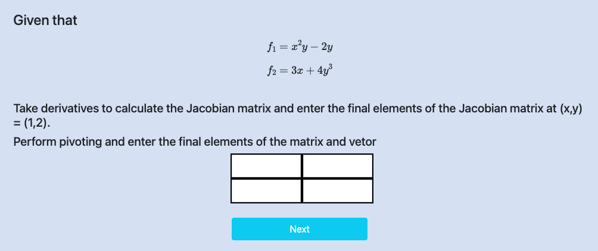
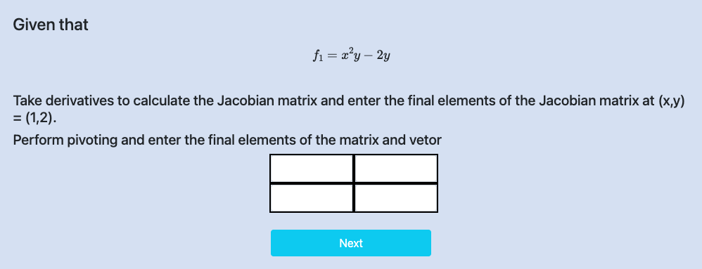

<h3>Step I:    Click on “Next”.</h3>

    

<h3>Step II: Calculate and Enter Jacobian Matrix values.</h3>

    

<h3>Step III:</h3>

    

<h3>Step IV: Calculate and Enter Hessian Matrix values.</h3>

    

